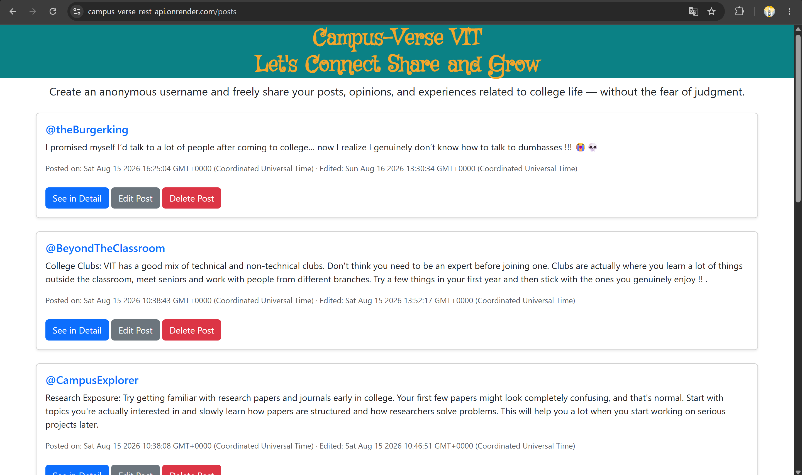
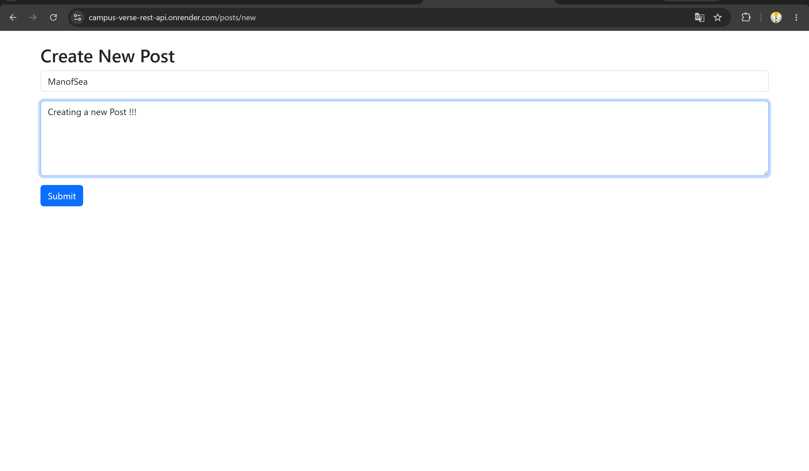
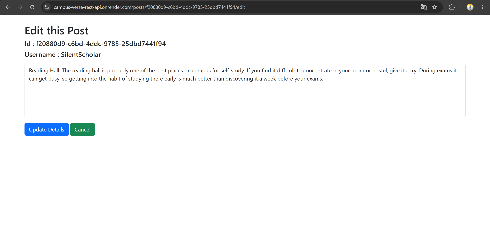
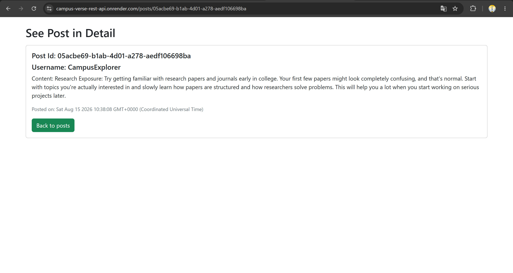

# Campus Verse 🎓

A college posting platform built while learning **Node.js, Express.js, EJS, REST APIs, and MySQL**.

Students can create anonymous posts to share their college-related thoughts, experiences, and opinions.

## 🚀 Live Demo

Try the deployed version:

https://campus-verse-rest-api.onrender.com

> The live demo may occasionally be unavailable when the cloud services are sleeping or temporarily offline. Screenshots of the application are provided below.

## 📸 Screenshots

### Posts


### Create Post


### Edit Post


### View Post In Detail 


## 🛠️ Tech Stack

* Node.js
* Express.js
* EJS
* MySQL
* REST APIs
* Bootstrap
* UUID
* Aiven — Cloud MySQL
* Render — Deployment

## ✨ Features

* Create, view, edit and delete posts
* Anonymous usernames
* UUID-based post IDs
* Created & updated timestamps
* MySQL database persistence
* Cloud database integration
* Deployed backend

## 🔌 Routes

```text
GET     /posts          → View all posts
GET     /posts/new      → Show create-post form
POST    /posts          → Create a new post
GET     /posts/:id      → View a specific post
GET     /posts/:id/edit → Show edit-post form
PATCH   /posts/:id      → Update a post
DELETE  /posts/:id      → Delete a post
```

## 💻 Run Locally

### 1. Clone the repository

git clone https://github.com/Ayush17281/campus-verse-rest-api.git

### 2. Go to the project folder

cd campus-verse-rest-api

### 3. Install dependencies

npm install

### 4. Set up MySQL

Create a MySQL database and run the `schema.sql` file to create the `posts` table.

### 5. Create `.env`

Add your MySQL connection details:

DB_HOST=your_host
DB_PORT=your_port
DB_USER=your_user
DB_PASSWORD=your_password
DB_NAME=your_database_name

### 6. Start the server

npm start

Open:

http://localhost:8080/

## 📚 What I Learned

* Express routing & middleware
* REST APIs and CRUD operations
* EJS templating
* MySQL integration
* UUIDs & parameterized queries
* Environment variables
* Git & GitHub
* Cloud deployment with **Aiven + Render**

> A project built as part of my MERN Stack learning journey.
